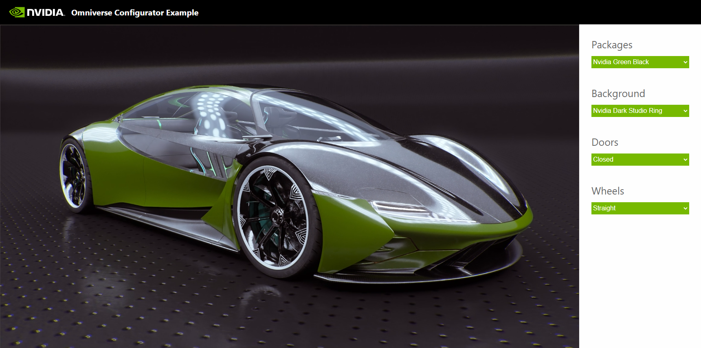

# Omniverse Configurator Sample Application

  

The sample demonstrates how a front end client can present a streamed 
Omniverse Kit application and how to send messages back and forth between 
the two apps.

This application is designed to be used with the `USD Viewer Sample` in https://github.com/NVIDIA-Omniverse/kit-app-template. However, with some editing, it can also be 
used to stream any other Kit application as well. 

This is a React application that has been built using the Vite 
framework (https://github.com/vitejs).

Refer to the [End-to-End Configurator Example Guide](https://docs.omniverse.nvidia.com/auto-config/latest/index.html) for instructions on creating a configurator from start to finish and to download the [Concept Car - Published Files](https://docs.omniverse.nvidia.com/auto-config/latest/sample-assets.html#concept-car-published-files) Sample Asset required for this application.

## Table of Contents
- [Prerequisites](#prerequisites)
- [Quick Start](#quick-start)
    - [Interacting with the solution](#interacting-with-the-solution)
- [Front End Client Development](#front-end-client-development)
- [Troubleshooting](#troubleshooting)
- [License](#license)
- [Contributing](#contributing)

## Prerequisites

- Node.js installation (https://nodejs.org/en/download).
- Chromium browser.
- [Concept Car - Published Files](https://docs.omniverse.nvidia.com/auto-config/latest/sample-assets.html#concept-car-published-files) Sample Asset

## Quick Start

Here we will run the solution in dev mode.

1. Make sure the prerequisites are fullfilled.

2. Start USD Viewer and load the `product_configurator_base.usd` stage from the [Concept Car - Published Files](https://docs.omniverse.nvidia.com/auto-config/latest/sample-assets.html#concept-car-published-files) package. Refer to the [kit-app-template documentation](https://github.com/NVIDIA-Omniverse/kit-app-template/tree/main/templates/apps/usd_viewer#default-launch-state) for instructions on how to load a stage when launching USD Viewer.

3. Execute the following commands from the project root directory to run this front end client in dev mode:

- `> npm install`
- `> npm run dev`

4. Open a Chromium browser and navigate to `localhost:5173`.

5. After the stage loads, you should see the Kit application streamed into the web page.

### Interacting with the solution

The streamed RTX viewport within this client is interactable:

- Left mouse button click on the viewport to activate its interactivity by giving it focus.
- Left mouse button drag to rotate around the Concept Car.
- Right mouse button drag to orbit with the camera.
- Scroll wheel to zoom

The `Packages` selector sets variants that control the Concept Car's color.

The `Background` selector sets a variant that controls the background image.

The `Doors` selector sets a variant that controls if the doors are open or closed.

The `Wheels` selector sets a variant that controls the direction of the wheels.

### Stream Settings

The stream configuration settings can be modified in the [stream.config.json](./stream.config.json) file. Below is an explanation of this file's parameters:

- source `string`: set to `"local"` for local streaming or `"gfn"` to stream via GDN
- gfn:
    - catalogClientId `string`: value is provided during GDN onboarding
    - clientId `string`: value is provided during GDN onboarding
    - cmsId `integer`: must match the CMS ID for your asset’s title in the GeForce NOW Developer Portal
    - prewarmed `boolean`: set to `true` if using a prewarmed asset, otherwise `false`
- local:
    - server `string`: the IP address where the Kit application is streamed from

## Updating Dependencies

This repository includes a [package.json](./package.json) file, for defining dependencies, and a [package-lock.json](./package-lock.json) file, for locking dependencies to specific versions. When executing `npm install`, a `node_modules` directory is created that contains the dependencies as defined in these files. If you need to update dependencies (such as after pulling new changes from the repo that require newer versions of packages to be installed), follow these steps:

1. Delete the [package-lock.json](./package-lock.json) file

2. Delete the `node_modules` directory

3. Execute the `> npm install` command

## Front End Client Development

Refer to the Omniverse Web Viewer Sample Application [GitHub documentation](https://github.com/NVIDIA-Omniverse/web-viewer-sample/blob/main/README.md#front-end-client-development) for information on how to implement the `omniverse-webrtc-streaming-library` in your own client.

## Troubleshooting

Things don't always turn out as expected. If you are not getting the expected results, use the below steps to troubleshoot.

- Check the browser console for errors.
- Check the Kit application log for errors.
- Test with an unmodified version of the project to see if any changes may have created some problem.
- If you are streaming the Omniverse Kit application from another device, does the problem go 
away if you stream it on the same device that this front end client is running on? If so, you may have a
network issue.
- Check if your browser was updated to a more recent version. Sometimes browsers are set to be auto 
updated. Does it work if you use an older version?
- Check the web browser log for errors.
- Check the Omniverse Kit application. Did something go wrong at the other end?
- Ensure that [dependencies are updated](#update-dependencies)
- Restart the solution:
  - Shut down the dev server. 
  - Shut down the Kit application. 
  - Start the Kit application. 
  - Start the dev server: `npm run dev`

## License

Development using the Omniverse Kit SDK is subject to the licensing terms detailed [here](https://docs.omniverse.nvidia.com/install-guide/latest/common/NVIDIA_Omniverse_License_Agreement.html).

## Contributing

We provide this source code as-is and are currently not accepting outside contributions.

